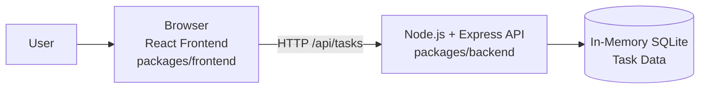

# Cloud Architecture Overview

This monorepo contains a React frontend and a Node.js/Express backend. The frontend runs in the browser and calls the backend over HTTP. The backend currently uses an in-memory SQLite database, so task data exists only for the lifetime of the running server process.

## Components

- `packages/frontend`: React application that renders the TODO UI and sends task requests to the backend API.
- `packages/backend`: Express server that exposes task CRUD endpoints under `/api/tasks`.
- In-memory SQLite: Temporary task storage used by the backend during runtime.

## Notes

- This is a simple system context view, not a deployment diagram.
- There is no external cloud infrastructure, managed database, or third-party integration in the current implementation.
- Because the database is in memory, restarting the backend clears stored tasks.